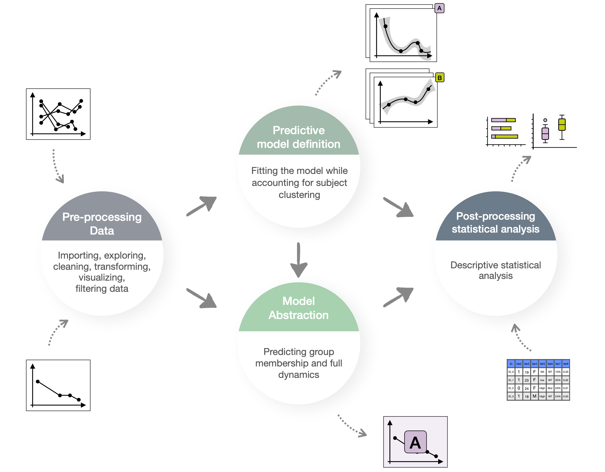

# MCL explorer

<p align="center">
  <a href="https://qbio.di.unito.it/">
    
  </a>
</p>


This application is designed to aid researchers in inspecting and classifying CONNECTOR clusters for Minimal Residual Disease in Mantle Cell Lymphoma.

1. **Clustering Exploration**: Visualize and explore the 'FIL-MCL0208' dataset, which contains key information about connector clusters.

2. **Classification Exploration**: Classify data from the 'MCL Younger' dataset based on clusters identified in the 'FIL-MCL0208' analysis.

3. **Costum Classification**: Upload and classify your own dataset to apply insights gained from the 'FIL-MCL0208' clusters to new data.
            
<p align="center">
    
</p>           
                         
## Getting started

```
devtools::install_github("qBioTurin/mclexplorer", dependencies=TRUE)
```

To run the application, it is necessary to install the following version of the CONNECTOR package:

```
devtools::install_github("qBioTurin/connector", ref="Classification",dependencies=TRUE)
```

For more information on the connector methodology, please refer to:

[Simone Pernice, et al. 'CONNECTOR, fitting and clustering of longitudinal data to reveal a new risk stratification system', Bioinformatics (2023)]( https://academic.oup.com/bioinformatics/article/39/5/btad201/7133735?login=true")

## How to run 

```
mclexplorer::mclexplorer.run()
```

## Dependecies 

Since the R package "ggmosaic" was archived on 2025-11-10, we suggest to install it from its github:

```
install.packages("devtools")
devtools::install_github("haleyjeppson/ggmosaic")
```

<p align="center">
  <a href="https://qbio.di.unito.it/">
    
  </a>
</p>
